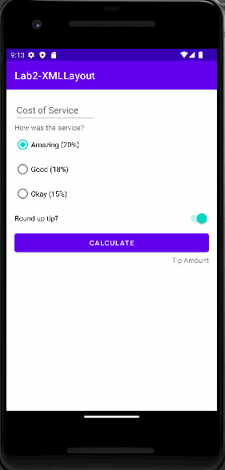

# Words App

This folder contains the source code for the XML Layout app codelab.

# Introduction
In this codelab, we will be building the layout for a basic tip calculator app. At the end of the 
codelab, we'll have a working UI for the app, but the app won't actually calculate the tip yet.

# Pre-requisites
1. Able to create and run an Android app from a template in Android Studio

Final gif
---------------

